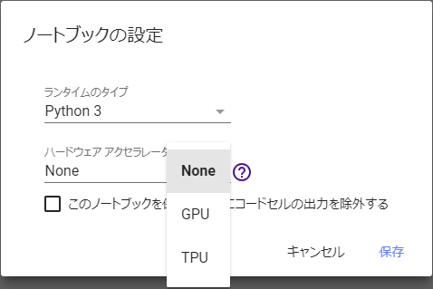
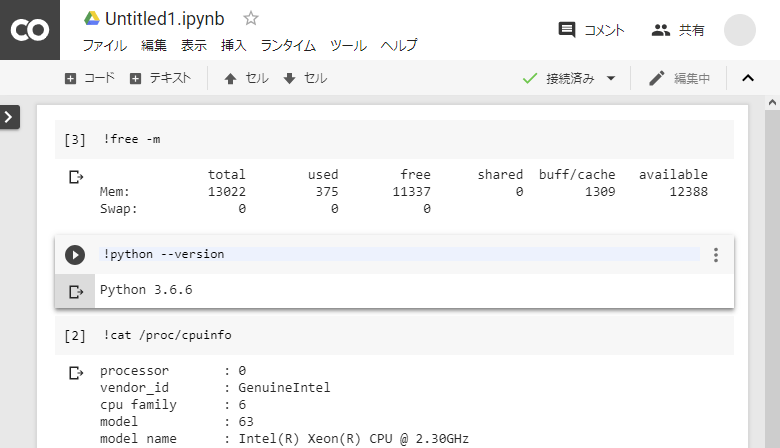
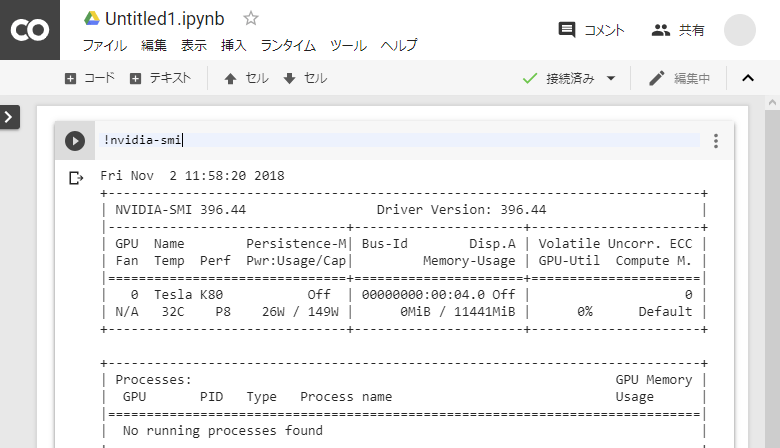
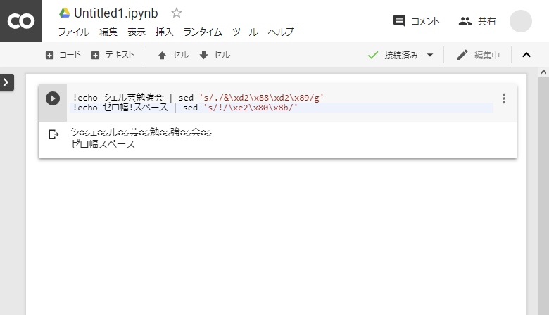
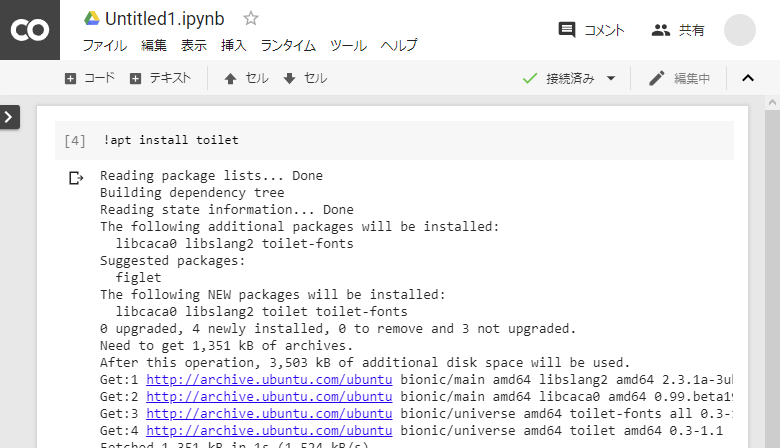
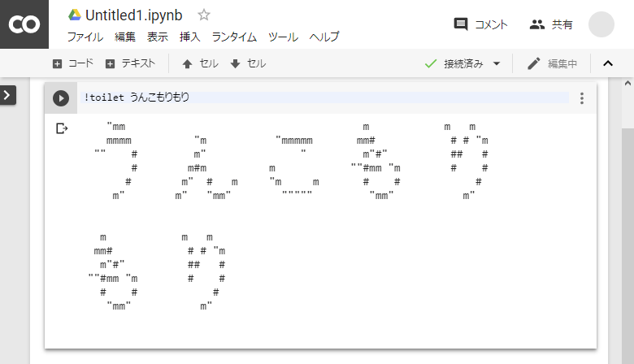

## Google Colaboratoryの間違った使い方

@第38回シェル芸勉強会 大阪サテライト


---
## 目次
* Google Colaboratoryとは
* 実態
* 無駄遣い
* まとめ


---
## 自己紹介
* ハンドルネーム: MSR
    * [Twitter ID: @msr386](https://twitter.com/msr386)
* Webブラウザ [Tungsten](https://app.tungsten-start.net/) の作者


---
### Google Colaboratoryとは
* Googleが機械学習の教育、研究のために用意した無料のPython実行環境
* モダンブラウザとGoogleアカウントさえあればアクセス可能
* 機械学習に必要な環境は最初から構築済  
  TensorFlowやmatplotlibなどがインストール済の仮想マシンが用意され、すぐに実行できる


---
### Google Colaboratoryとは
* GPUもTPUも無料で使える  


---
### Google Colaboratoryの実態


---
## 共通
* 連続使用時間は12時間
* アイドリングストップ機構あり(90分)


---
## GPUなし



---
## GPUなし
* GCEのn1-highmem-2インスタンスがベース
    * CPU: 2コア 2.3GHz
    * メモリ: 13GB
    * ストレージ: 40GB (GPU使用時は360GB)
    * OS: Ubuntu 18.04.1 LTS
    * Python: 2.7 or 3.6.6
* 常時稼働ならば \7000/月 相当


---
## GPU
* Tesla K80 相当のGPU



---
## TPU

* 第2世代TPU?


---
### Google Colaboratoryを無駄遣いする

---
### 普通の使い方

* 機械学習の教育、研究用に使う


---
### 間違った使い方




---
### 間違った使い方

* シェル芸の気軽な実行環境として使う
* ~~危険シェル芸~~ (絶対にダメ)

※目的外の使用はほどほどに


---
### 使用方法

1. https://colab.research.google.com/ にアクセス
1. [ファイル]メニューから新しいノートブックを開く
1. (必要に応じて)Googleアカウントでログイン
1. コードブロックにコードを書いていく


---
### Pythonでコマンド実行
subprocessを使う

```
import subprocess
proc = subprocess.run(["uname", "-a"],
                      stdout = subprocess.PIPE,
                      stderr = subprocess.PIPE)
print(proc.stdout.decode("utf8"))
```


---
### Tips (1)

* 先頭に"!"をつけるだけでも実行できる
* `Ctrl+Enter`で実行可能

---
### Tips (2)
* インターネット接続可
* Git標準搭載
* apt install可能
* インスタンスが停止するときれいさっぱり忘れる


---



---


---
## 実行デモ


---
### 参考

* よくある質問  
  https://research.google.com/colaboratory/faq.html
* Google Colabの知っておくべき使い方 – Google Colaboratoryのメリット・デメリットや基本操作のまとめ  
  https://www.codexa.net/how-to-use-google-colaboratory/
* 【秒速で無料GPUを使う】深層学習実践Tips on Colaboratory  
  https://qiita.com/tomo_makes/items/b3c60b10f7b25a0a5935
* Google ColaboratoryのTPUを試してみる  
  https://qiita.com/koshian2/items/25a6341c035e8a260a01


---
## まとめ

- Google Colaboratoryは機械学習の教育、研究を目的とした研究用ツール
- 実態は機械学習環境構築済のLinux仮想マシン
- 目的外の使用は控えましょう
